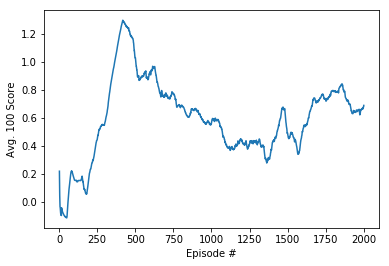
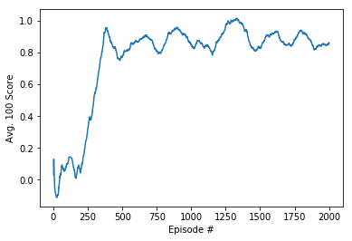
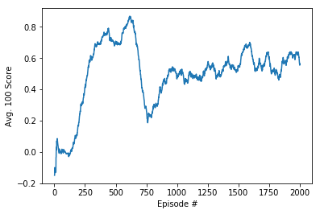

[//]: # (Image References)

[image1]: https://user-images.githubusercontent.com/10624937/42135623-e770e354-7d12-11e8-998d-29fc74429ca2.gif "Trained Agent"
[image2]: https://user-images.githubusercontent.com/10624937/42135622-e55fb586-7d12-11e8-8a54-3c31da15a90a.gif "Soccer"

[DDPG]: https://arxiv.org/pdf/1509.02971.pdf
[MADDPG]: https://arxiv.org/pdf/1706.02275.pdf
[PSNE]: https://arxiv.org/pdf/1706.01905.pdf
[Layer Normalization]: https://arxiv.org/abs/1607.06450

# Project 3: Collaboration and Competition

### Introduction

For this project I'm implementing a multi-agent scenario, working with the [Tennis](https://github.com/Unity-Technologies/ml-agents/blob/master/docs/Learning-Environment-Examples.md#tennis) environment.

![Trained Agent][image1]

Two agents control rackets to bounce a ball over a net. If an agent hits the ball over the net, it receives a reward of +0.1.  If an agent lets a ball hit the ground or hits the ball out of bounds, it receives a reward of -0.01.  Thus, the goal of each agent is to keep the ball in play.

The observation space consists of 8 variables corresponding to the position and velocity of the ball and racket. Each agent receives its own, local observation.  Two continuous actions are available, corresponding to movement toward (or away from) the net, and jumping. 

The task is episodic, and in order to solve the environment, the agents must get an average score of +0.5 (over 100 consecutive episodes, after taking the maximum over both agents). Specifically,

- After each episode, we add up the rewards that each agent received (without discounting), to get a score for each agent. This yields 2 (potentially different) scores. We then take the maximum of these 2 scores.
- This yields a single **score** for each episode.

The environment is considered solved, when the average (over 100 episodes) of those **scores** is at least +0.5.

*Note*: Since at every step the highest score is 0.1, a score of 0.5 is the equivalent of 5 steps with a positive reward in an episode.

### Intro
For the Tennis game, the desired outcome of the solution is the maximization of either player's score.
Since this score is maximized when the ball is kept in play, the maximization of the desired overall goal aligns with the maximization of each player's rewards.
Thus this is a *collaborative* environment.

The following have been applied to solve the environment

#### Adapted [DDPG] for multi-agent environment (*SADDPG*)
Here I train only one agent to play both players. Since [DDPG] trains one agent (i.e. one network), it is necessary to adapt the agent to be aware of which role it is under at any given time. Additionally, if we define the full state of the environement as the combined knowledge of both players' states, then each player *partially* observes the environment. Therefore this setup does not fit out-of-the-box with the original formulation of [DDPG].
So, the following adjustments were made to [DDPG] to accomodate the multi-agent scenario:
* The critic inputs the full environment state, which is the concatenation of the partial observed states from each player.
* For the Tennis environment, since we have 2 players, the full observed state input into the action value function (Q) is flipped, depending on the player role the agent takes. This way gives the agent awareness of the role.
* Use one policy function, which takes the partial observations of each player accordingly - given a particular role.
* Replay buffer does not make a distinction between each player's transitions. However, for each transition, the full observations are adapted for each player before being inserted into the buffer. This means that a full observation is inserted twice, but one of them is flipped. Alternatively, partial observations for each player could be marked, but then the algorithm would need to be modified to accomodate the gradients for each player. The former method requires less code manipulation.

Since under the multi-agent environment this variant of DDPG uses a single agent, I am referring to it as *SADDPG* to differentiate it from *MADDPG*

Below is the 100-episode (sliding window) average scores for SADDPG

#### [MADDPG]
[MADDPG] implements decentralized actors with centralized critics. This means that each agent has its own policy, each with its partial observations of the environment, and a dedicated all-knowing critic guiding it in the right direction. "All-knowing" here means that each agent's critic inputs the full environment state, as well as all actions from all the agents in the game, and output the expected value for each agent.
However the gradients, and consequently the updates, are taken with respect to the parameters of the particular agent's critic parameters.

Since each agent has its own policy and value function, [MADDPG] allows the arbitrary structuring of the reward system for each agent.
This way we could have a competitive or collaborative setting. Under the Tennis environment we have a collaborative environment since the maximization of both actors's score maximizes the desired overall score (i.e. this is not a zero-sum game).

These are the 100-episode (sliding window) average scores for MADDPG.

As we can see, MADDPG retains the performance across the training process.

#### [MADDPG] with [PSNE]
In the traditional [DDPG]/[MADDPG] exploration is usually achieved by perturbing the actions using Ornstein–Uhlenbeck process or just using Normal distribution. Under this approach, for a given policy we are not guaranteed consistent state transitions.
An alternative method to explore is by perturbing the parameters space of the policy. In [PSNE] the parameters of the layers of the network are perturbed by adding some measurable normal noise. Layer normalization is used between the hidden layers to achieve meaningful noise perturbation across the hidden layers.
Noise std. dev is adapted as learning progresses, since sensitivity of the network differs through this process. For more details refer to the paper.

With PSNE instantaneous scores are far noisier than vanilla MADDPG (see report). Perhaps a better hyperparameter set needs to be employed.

#### Network Topologies
The Actor/Critic networks consisted of MLPs, each with 2 hidden layers with 256 units each. Actors use [Layer Normalization].

##### Hyperparameters and devil-in-detail tricks
Discount factor (gamma) used is 0.995, with momentum term (tau) 0.01. Learning rates for both actor and critic were 0.01, and a batch of 512.
A learning step was performed for every 50 new transitions added to the reply buffer (a novelty factor).
Moreover, in order to reduce the variance during learning, the gradients of both actors and critics were clipped to 0.5 and batch normalization layers were used at the input for both actor/critic networks.

### Results

Simulation code and results are contained in  `Tennis.ipynb` or `Report.html`.

#### Quick points
All 3 variants solved the environment in about the same number of episodes.
* MADDPG was able to retain the score across the 2000 episodes.
* MADDPG with PSNE was much noiser (instantaneous scores).
* SADDPG a more economical solution (one policy). Performs better in a collaborative enviroment. Stable play.

#### Run an episode
Call `run.py -m <model type> -t <number of simu steps>` to run an example. Model types:
* MADDPG
* SADDPG
* MADDPG_PSNE